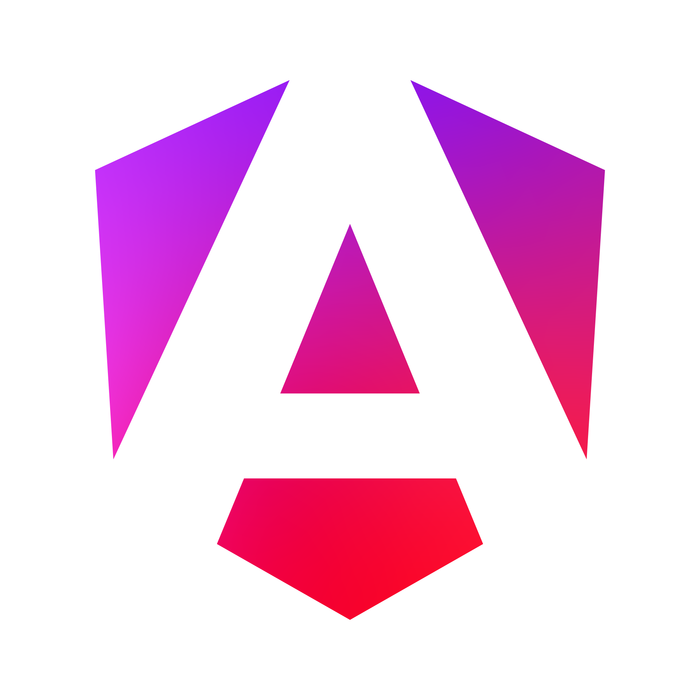

## Saya sangat tertarik di bidang Data Engineer dan PostgreSQL Database Administrator dan Backend Developer 📈📊🧑‍💻

## Lagi Belajar Ini:

<table>
  <tr>
    <td align="center" valign="middle">
       
      <b>Linux</b>
    </td>
    <td align="center" valign="middle">
       
      <b>Fedora Linux</b>
    </td>
    <td align="center" valign="middle">
       
      <b>Fedora Kinoite</b>
    </td>
    <td align="center" valign="middle">
       
      <b>Bazzite</b>
    </td>
  </tr>
  <tr>
    <td align="center" valign="middle">
       
      <b>Rust</b>
    </td>
    <td align="center" valign="middle">
       
      <b>Go</b>
    </td>
    <td align="center" valign="middle">
       
      <b>Apache Kafka</b>
    </td>
    <td align="center" valign="middle">
       
      <b>Java</b>
    </td>
  </tr>
  <tr>
    <td align="center" valign="middle">
       
      <b>Spring / Spring Boot</b>
    </td>
    <td align="center" valign="middle">
       
      <b>Dart</b>
    </td>
    <td align="center" valign="middle">
       
      <b>Flutter</b>
    </td>
    <td align="center" valign="middle">
       
      <b>HTTP</b>
    </td>
  </tr>
  <tr>
    <td align="center" valign="middle">
       
      <b>HTML</b>
    </td>
    <td align="center" valign="middle">
       
      <b>CSS</b>
    </td>
    <td align="center" valign="middle">
       
      <b>JavaScript</b>
    </td>
    <td align="center" valign="middle">
       
      <b>Bootstrap CSS</b>
    </td>
  </tr>
  <tr>
    <td align="center" valign="middle">
       
      <b>Node.js</b>
    </td>
    <td align="center" valign="middle">
       
      <b>Tailwind CSS</b>
    </td>
    <td align="center" valign="middle">
       
      <b>Express.js</b>
    </td>
    <td align="center" valign="middle">
       
      <b>TypeScript</b>
    </td>
  </tr>
  <tr>
    <td align="center" valign="middle">
       
      <b>Vite</b>
    </td>
    <td align="center" valign="middle">
       
      <b>Vue.js</b>
    </td>
    <td align="center" valign="middle">
       
      <b>React.js</b>
    </td>
    <td align="center" valign="middle">
       
      <b>Angular</b>
    </td>
  </tr>
  <tr>
    <td align="center" valign="middle">
       
      <b>Python</b>
    </td>
    <td align="center" valign="middle">
       
      <b>Django</b>
    </td>
    <td align="center" valign="middle">
       
      <b>Flask</b>
    </td>
    <td align="center" valign="middle">
       
      <b>PHP</b>
    </td>
  </tr>
</table>

